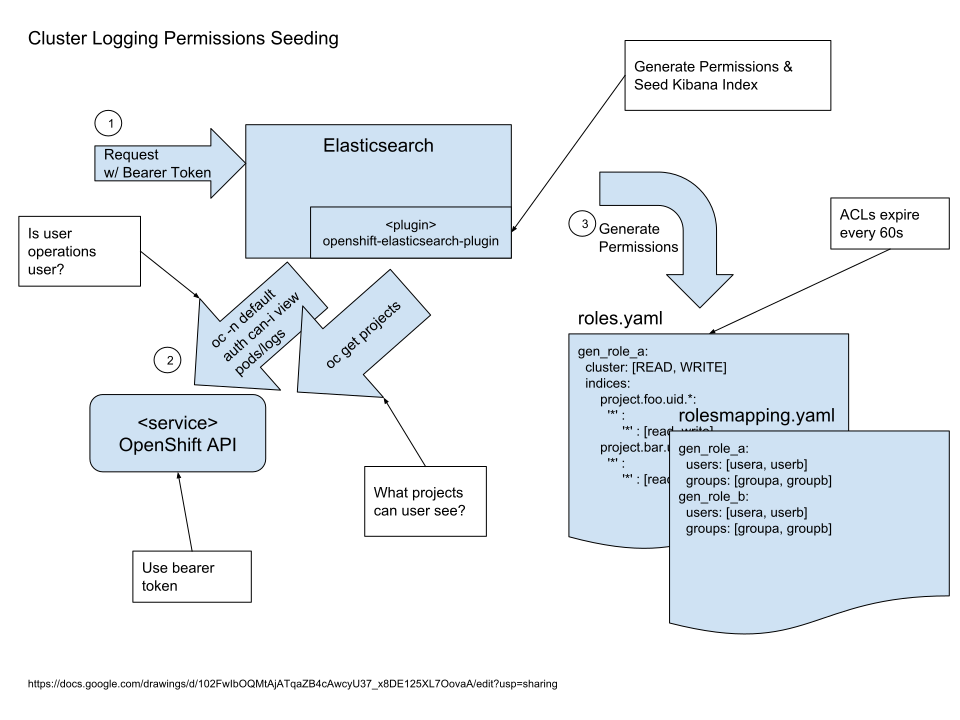
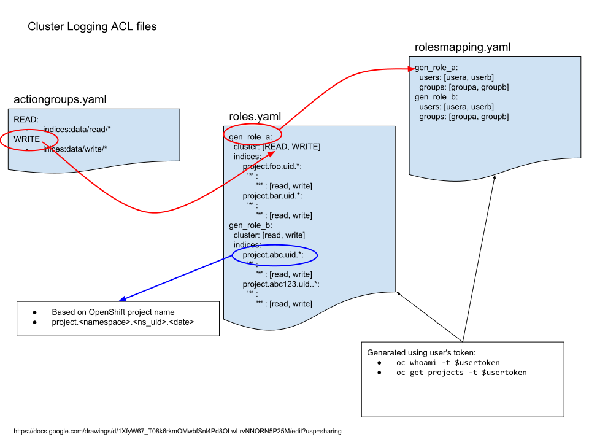

# Multi-tenant Support and Access Control
Multi-tenant support and access control is provided by the [openshift-elasticsearch-plugin](https://github.com/fabric8io/openshift-elasticsearch-plugin).
This plugin utilizes [SearchGuard](https://github.com/floragunncom/search-guard) to define and maintain role based access control lists.  Roles are generated
based upon the Openshift projects that are visible to an Openshift user.  The following is a brief explanation how roles and role mappings are generated.
Please see the [official SearchGuard documentation](http://floragunncom.github.io/search-guard-docs) for additional information related to SearchGuard.

## Role Definitions and Permissions
The permissions for a user are generated when an authenticated user makes their first request to Elasticsearch.  This request typically originates from
the Kibana user interface provided by the Openshift logging stack.  The `openshift-elasticsearch-plugin` retrieves the list of projects, on behalf of a user,
that are visible to the user.  Figure 1 Diagrams this workflow:

**Figure 1**




The plugin will generate roles for each user similiar to:

```
gen_ocp_kibana_shared:
  cluster: [CLUSTER_MONITOR_KIBANA]
  indices:
    '*':
      '*': [INDEX_ANY_KIBANA]
gen_project_operations:
  cluster: [CLUSTER_OPERATIONS]
  indices:
    '*?*?*':
      '*': [INDEX_ANY_OPERATIONS]
    ?operations?:
      '*': [INDEX_OPERATIONS]
gen_kibana_4c54bf89fe913f39fc22d76309f80cdc6192928f:       #hash of the username
  cluster: [USER_KIBANA_CLUSTER_OPERATIONS]
  indices:
    '*':
      '*': [USER_ALL_INDEX_OPS]
    ?kibana?4c54bf89fe913f39fc22d76309f80cdc6192928f:
      '*': [INDEX_KIBANA]
gen_user_4c54bf89fe913f39fc22d76309f80cdc6192928f:         #hash of the username
  cluster: [USER_CLUSTER_OPERATIONS]
  indices:
    ?kibana?4c54bf89fe913f39fc22d76309f80cdc6192928f:
      '*': [INDEX_KIBANA]
    ?project?foo?bar?*
      '*': [INDEX_PROJECT]
    distinguishedproj?*:
      '*': [INDEX_PROJECT]
```


**Note:** Question marks replace dots in the ACL document.  In this example, the `gen_user_4c54bf89fe913f39fc22d76309f80cdc6192928f`
allows a given set of permissions to the `project.foo.bar.*` indices.

**Note:** Index permissions that do not begin with 'project' are for legacy support.  Current releases of the Openshift logging
stack rely upon the [common data model](https://github.com/ViaQ/fluent-plugin-viaq_data_model) (CDM) and adds the 'project' prefix.

Each role defines permissions for cluster and index related actions (see **Figure 2**). The list of possible permissions are described by the [Elasticsearch Shield documentation](https://www.elastic.co/guide/en/shield/2.2/privileges-list.html#ref-actions-list). Within each index definition, the actions allowed for a given
index are further declared based on the document type.  Additionally, each declaration uses an action group (e.g. `INDEX_OPERATIONS`)
to abstract the allowed set of defined permissions.  Action groups are defined in a
[separate document](../elasticsearch/sgconfig/sg_action_groups.yml) similar to:

```
ALL:
  - "indices:*"
...

INDEX_KIBANA:
  - ALL
INDEX_ANY_KIBANA:
  - INDEX_ANY_ADMIN
  - MANAGE
INDEX_OPERATIONS:
  - INDEX_ANY_ADMIN
INDEX_ANY_OPERATIONS:
  - INDEX_ANY_ADMIN
INDEX_PROJECT:
  - INDEX_ANY_ADMIN
---
```

The plugin will also generate mappings in order to assign users to the roles similar to:

```
gen_kibana_994a33f6a157ba4a286395f81a4333db1e6cefb6:
  users: [user2.bar@email.com]
gen_ocp_kibana_shared:
  users: [user1, user3]
gen_project_operations:
  users: [user1, user3]
gen_user_994a33f6a157ba4a286395f81a4333db1e6cefb6:
  users: [user2.bar@email.com]
```

**Figure 2**


